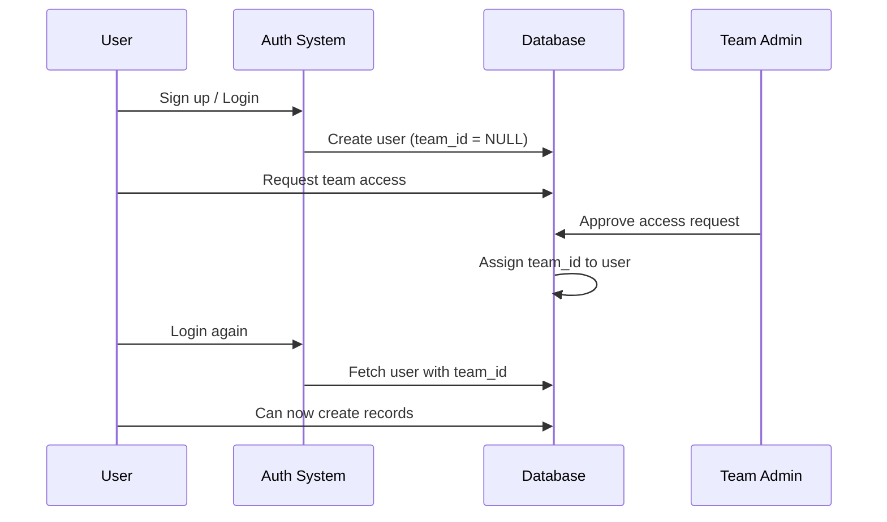

# Database Fix Guide - TeamID & Master Admin Issues

## 🚨 Problem Summary

You're experiencing two critical issues:

1. **"Can't find user's teamID" error** when creating records - even though users have teamID in the database
2. **No `is_master_admin` column** in the database - preventing master admin functionality

## 🔍 Root Causes

### Issue #1: Missing `is_master_admin` Column

- **Problem**: The migration file exists ([scripts/migrations/001_add_is_master_admin.sql](scripts/migrations/001_add_is_master_admin.sql)) but was never applied to your database
- **Impact**: Your code tries to access `user.is_master_admin` but this field doesn't exist, causing failures
- **Evidence**: TypeScript types in [src/types/database.ts](src/types/database.ts) didn't include this field (now fixed)

### Issue #2: TeamID Validation Failures

- **Problem**: Schema mismatch between definition and actual database
  - `schema.sql` originally declared `team_id UUID NOT NULL`
  - But actual database has `team_id` as nullable (to support access request flow)
  - Code expects `teamContext.teamId` to exist, throws error when null
- **Impact**: Users who haven't been assigned a team yet (pending access requests) cannot create any records
- **Root Cause**: When users sign up via access request, they login BEFORE getting team assignment

## ✅ Fixes Applied

I've made the following code changes:

### 1. Updated TypeScript Types ([src/types/database.ts](src/types/database.ts))
```typescript
users: {
  Row: {
    // ... existing fields
    team_id: string | null  // Already nullable
    is_master_admin: boolean  // ✅ ADDED
  }
}
```

### 2. Fixed Schema Definition ([scripts/schema.sql](scripts/schema.sql))
```sql
CREATE TABLE users (
  -- ... existing fields
  team_id UUID REFERENCES teams(team_id) ON DELETE CASCADE, -- ✅ Now nullable
  is_master_admin BOOLEAN DEFAULT FALSE, -- ✅ ADDED
);
```

### 3. Created Database Migration Scripts
- ✅ [scripts/fix-database-issues.sql](scripts/fix-database-issues.sql) - Fixes both issues in your live database
- ✅ [scripts/create-master-admin.sql](scripts/create-master-admin.sql) - Designates your master admin user

## 🛠️ How to Fix Your Database

### Step 1: Apply Database Fixes

1. **Open Supabase Dashboard**
   - Go to https://app.supabase.com
   - Select your project
   - Click **"SQL Editor"** → **"New Query"**

2. **Run the Fix Script**
   - Open [scripts/fix-database-issues.sql](scripts/fix-database-issues.sql)
   - Copy the entire contents
   - Paste into Supabase SQL Editor
   - Click **"Run"**
   - Verify you see: `✓ ALL FIXES APPLIED SUCCESSFULLY`

### Step 2: Create Master Admin User

1. **Open the Master Admin Script**
   - Open [scripts/create-master-admin.sql](scripts/create-master-admin.sql)
   - Find line 20: `admin_email TEXT := 'your-admin@example.com';`
   - **CHANGE** `'your-admin@example.com'` to your actual admin email

2. **Run the Script**
   - Copy the entire contents (with your email updated)
   - Paste into Supabase SQL Editor
   - Click **"Run"**
   - Verify you see: `✓ MASTER ADMIN CREATED SUCCESSFULLY`

### Step 3: Verify the Fixes

Run this query in Supabase SQL Editor to verify:

```sql
-- Check master admin users
SELECT
  user_id,
  username,
  email,
  team_id,
  is_master_admin,
  status
FROM users
WHERE is_master_admin = TRUE;

-- Check column exists
SELECT column_name, data_type, is_nullable
FROM information_schema.columns
WHERE table_name = 'users'
  AND column_name IN ('team_id', 'is_master_admin');
```

Expected results:
- You should see your master admin user with `is_master_admin = true`
- `team_id` column should show `is_nullable = YES`
- `is_master_admin` column should show `is_nullable = YES` with `data_type = boolean`

### Step 4: Test the Application

1. **Log out and log back in** as the master admin user
2. **Try creating a new record** (client, candidate, vendor, etc.)
3. **Verify**:
   - ✅ No "can't find teamID" errors
   - ✅ Master admin can see all teams
   - ✅ Regular users are scoped to their team

## 📋 Multi-Tenant Architecture Overview

### Master Admin vs Local Admin

| Feature | Master Admin | Local Admin | Regular User |
|---------|-------------|-------------|--------------|
| **Team Access** | All teams (cross-tenant) | Single team only | Single team only |
| **Role Management** | ✅ Yes | ✅ Yes (their team) | ❌ No |
| **User Management** | ✅ Yes | ✅ Yes (their team) | ❌ No |
| **Create Records** | ✅ Any team | ✅ Their team | ✅ Their team |
| **Database Field** | `is_master_admin = true` | `role_name = 'Local Admin'` | Standard role |

### How Team Assignment Works



### How TeamID Validation Works

**Before Fix:**
```
createClient() → getTeamContext(userId) → user.team_id is NULL
→ ❌ Error: "User team not found"
```

**After Fix:**
```
createClient() → getTeamContext(userId) → Check if master admin
→ If master admin: Use target team OR null (all teams)
→ If regular user: Require team_id (proper error message)
→ ✅ Works correctly
```

## 🧪 Testing Guide

### Test 1: Master Admin Can Access All Teams

```typescript
// Master admin should see all teams' data
const clients = await getClients(masterAdminUserId);
// Should return clients from ALL teams
```

### Test 2: Regular User Scoped to Team

```typescript
// Regular user should only see their team's data
const clients = await getClients(regularUserId);
// Should return only clients from user's team
```

### Test 3: Create Records Without teamID Error

```typescript
// Should work for users with team_id
const result = await createClient(clientData, userId);
// Should succeed without "can't find teamID" error
```

### Test 4: Local Admin Role

```sql
-- Assign Local Admin role to a user
UPDATE users
SET role_id = (SELECT role_id FROM roles WHERE role_name = 'Local Admin')
WHERE email = 'local-admin@example.com';
```

Then verify in the app:
- Local admin can manage users/roles within their team
- Local admin CANNOT access other teams' data

## 📚 Related Documentation

- [Multi-Tenant Architecture](docs/MULTI_TENANT_ARCHITECTURE.md) - Detailed architecture guide
- [Entity API Migration Guide](docs/ENTITY_API_MIGRATION_GUIDE.md) - How to use team context in APIs
- [Team Context Utility](src/lib/utils/team-context.ts) - Core multi-tenant functions

## 🆘 Troubleshooting

### "User team not found" error still occurs

**Check:**
1. Did you run `fix-database-issues.sql`?
2. Does the user have `team_id` in the database?
   ```sql
   SELECT user_id, email, team_id, is_master_admin FROM users WHERE email = 'user@example.com';
   ```
3. Is the user a master admin? (They don't need team_id)

**Fix:**
- If user is **not** master admin and has no team_id:
  - They need to request team access OR
  - Manually assign team_id:
    ```sql
    UPDATE users SET team_id = 'your-team-id' WHERE email = 'user@example.com';
    ```

### Master admin not working

**Check:**
1. Is `is_master_admin` column present?
   ```sql
   SELECT column_name FROM information_schema.columns WHERE table_name = 'users';
   ```
2. Is the user actually set as master admin?
   ```sql
   SELECT email, is_master_admin FROM users WHERE email = 'admin@example.com';
   ```

**Fix:**
- Run `create-master-admin.sql` with correct email

### Local Admin role not showing

**Check:**
```sql
SELECT * FROM roles WHERE role_name = 'Local Admin';
```

**Fix:**
```sql
INSERT INTO roles (role_name, role_description)
VALUES ('Local Admin', 'Team administrator with team-scoped permissions')
ON CONFLICT (role_name) DO NOTHING;
```

## 🎯 Success Criteria

After applying these fixes, you should have:

- ✅ Master admin user designated and working
- ✅ Local Admin role created and assignable
- ✅ No "can't find teamID" errors when creating records
- ✅ Proper team isolation (users only see their team's data)
- ✅ Master admin can access all teams
- ✅ Access request flow works (users can login before team assignment)

## 📞 Need Help?

If you encounter issues:
1. Check the error messages in browser console and server logs
2. Verify database schema with queries above
3. Review [Multi-Tenant Architecture docs](docs/MULTI_TENANT_ARCHITECTURE.md)
4. Check that RLS policies are properly configured ([scripts/supabase-rls-policies.sql](scripts/supabase-rls-policies.sql))
